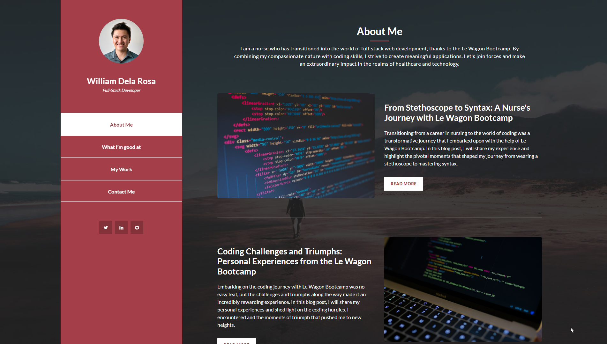

 

  

  <h3 align="center">My Portfolio </h3>

  

    My Portfolio Page
     
     
    <a href="https://williamtechportfolio.live/">View Demo</a>
  

## Table Of Contents

* [About the Project](#about-the-project)
* [Built With](#built-with)
* [Roadmap](#roadmap)
* [Authors](#authors)
* [Acknowledgements](#acknowledgements)

## About The Project

This Project is created for my Portfolio Page

## Built With

This Project is made of HTML, CSS, Javascript, Bootstrap template. This Project is hosted by netlify.

## Roadmap

Planned creation of Blog Page as a supplement to the page

## Authors

[//]: contributor-faces

[//]: contributor-faces

## Acknowledgements
* [Templatemo](https://#/)
* [icons8.com](https://icons8.com/) - Source of Title Bar Icon
